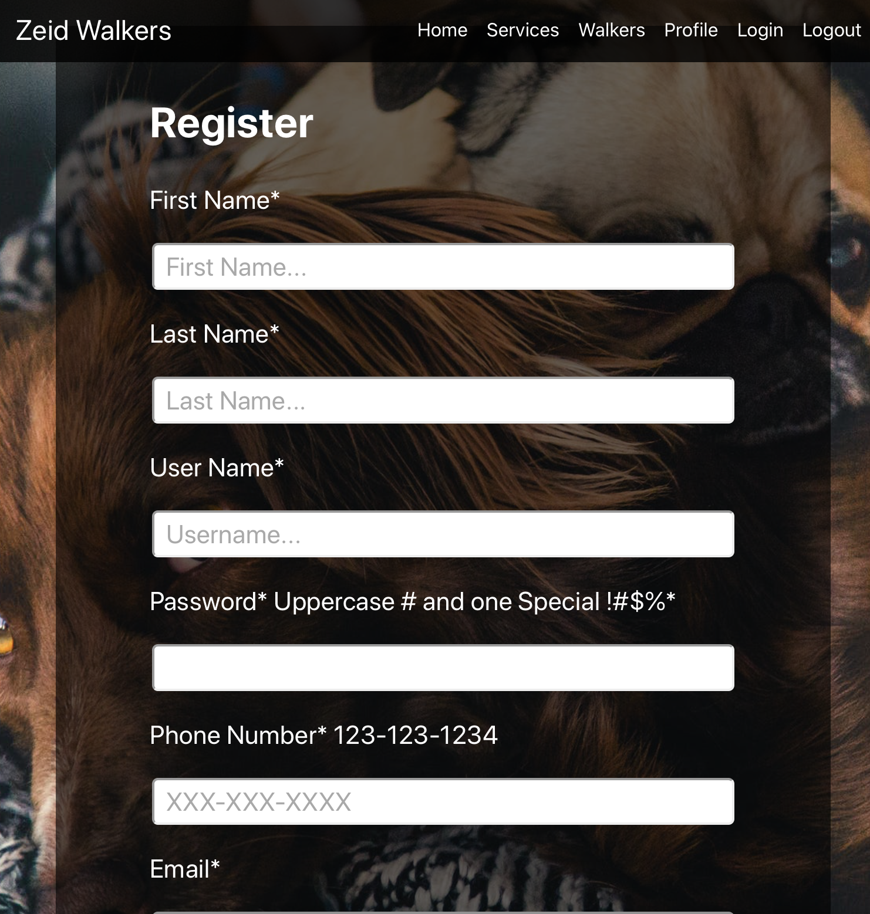

# Zeid Dog Walker Capstone

---------------------------------------------------------------------------------

 Live Demo: https://covid-frontend-master.zeidalidiez.vercel.app/
 
 Server Repo: https://github.com/zeidalidiez/covid-api-master
 
 Client Repo: https://github.com/zeidalidiez/covid-frontend-master
 
user_name: 'demouser',
password: 'demopassworD1!'

---------------------------------------------------------------------------------
## About:

We are a service to help people walk their dogs during these uneasy times of COVID.  Once logged in you'll be able to select from one of our walkers!  Just select the name of the walker, pick your Service and Time, then check your profile.  Your appointment will be updated! So Login or Sign up and we will take care of all of your dogwalks!!

---------------------------------------------------------------------------------

## Technologies Used

### FrontEnd

   * JavaScript
   * React
   * React-Router

### Backend

   * Postgres
   * NodeJs
   * Express
   * Knex
---------------------------------------------------------------------------------

## Routes

### '/' the Landing page route

This is the first page users will land on. Where they can see a demo of our site, sign up, and log in.

---------------------------------------------------------------------------------

### '/register' sign up page route

This is where users can sign up in order to get an authenticated JWT to access the entire website.  If they try access another route without an authenticated JWT they will be redirected back to the login page.

---------------------------------------------------------------------------------

### '/login' login page route 

This is where users can login with Username and Password to sign into the app.

---------------------------------------------------------------------------------

### '/dashboard' the dashboard route is private route for signed up users (and demo)

This is where users are directed after sign up and login. Users now have full access to finding dogwalkers, available times, and make an appointment.

---------------------------------------------------------------------------------

### '/service' the service route is private route for signed up users (and demo)

On this page, users view the prices for dog walking for one dog or multiple dogs.

---------------------------------------------------------------------------------

### '/walkers' the Walkers route is private route for signed up users (and demo)

 On this page, users view the available dogwalkers in their area. 

 ---------------------------------------------------------------------------------

### '/booking' the Booking route is private route for signed up users (and demo)

 On this page, users select the amount of dogs to walk, and the time they need to be walked and book their appointment.

 --------------------------------------------------------------------------------- 

### '/profile' the Profile route is private route for signed up users 

 On this page, users view their profile, which is their selected Time, Walker, and Service.  

